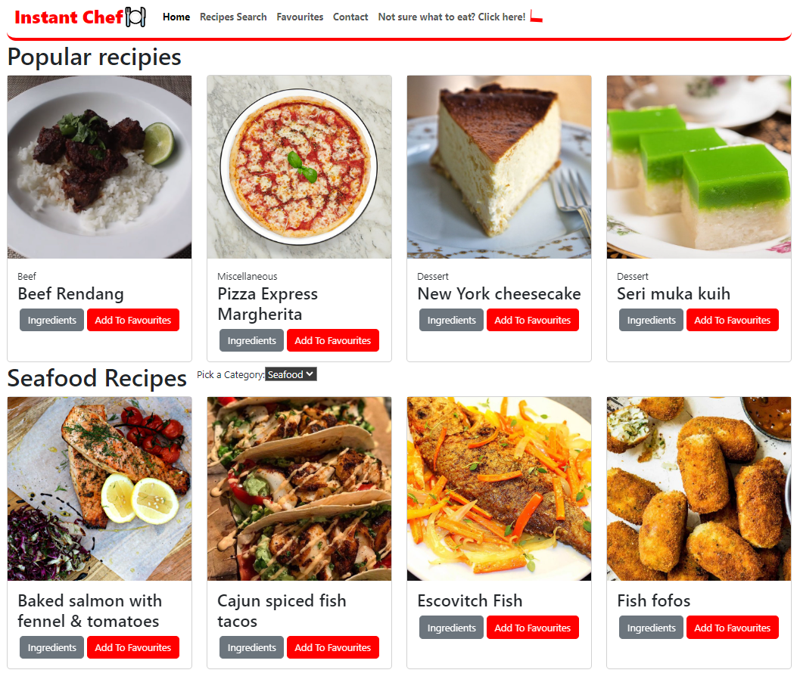
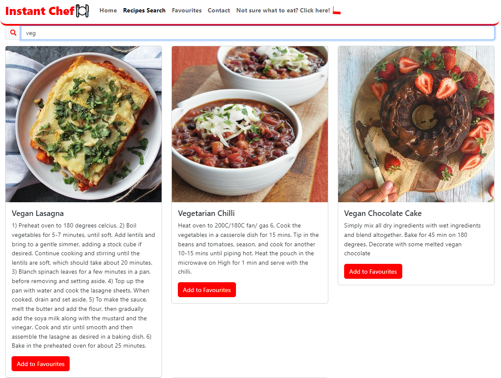

# Instant Chef

## Description

This web application offers users access to a vast collection of recipes. Users can explore recipes, search by name, and browse by letter. Integration of TheMealDB API enables dynamic content, like random recipe generation and filtering. Interactive features include favoriting recipes and submitting new ones via contact forms. Deployment on Netlify ensures cross-device accessibility for users.

## Features

- Add to Favourites: Users can add their favorite recipes to a list of favorites, which is stored using localStorage.
- Filter meals according to countries: Users can filter meals based on different countries using the provided API endpoints.
- Random recipes: The application fetches and displays random recipes using the provided API.
- Contact Us: For any inquiries, support requests, or recipe submissions, use the contact forms provided.
- LocalStorage: The code utilizes localStorage to store favorite recipes locally on the user's device.
- React: The codebase is built using React, making use of functional components, hooks such as useState and useEffect, JSX syntax, and React Router's useParams hook for accessing URL parameters.
- API Integration: The code integrates with TheMealDB API to fetch meal data, enabling dynamic content and interactions with external resources.
- Search by Name: Users can quickly find recipes by searching for specific meal names using the search method provided by the app.
- List by First Letter: The app provides the functionality to list meals starting with a specific letter, providing organized access to a wide range of recipes.

## Installation

To run this project locally, follow these steps:

1. Clone the repository: git clone https://github.com//Pine-Box/instant-chef
2. Navigate to the project directory: cd instant-chef
3. Install the dependencies: npm install
4. Start the development server: npm run dev

## Usage

- Exploring Recipes: Navigate through the various recipes available on the platform by browsing categories or searching for specific meals by name.
- Searching for Meals: Utilize the search functionality to find recipes quickly by entering the name of the desired meal.
- Browsing by Letter: Browse through recipes categorized by the first letter of their names, providing an organized way to explore the collection.
- Filtering by Category: Narrow down your recipe search by selecting specific categories such as countries
- Adding to Favorites: Favorite recipes that you enjoy to easily access them later for quick reference.
- Submitting Recipes: Share your own recipes with the community by submitting them through the provided contact forms.

## Technologies Used

- HTML
- CSS
- JavaScript
- JSX
- [React](https://react.dev/)
- [Bootstrap](https://getbootstrap.com/)
- [React bootstrap](https://react-bootstrap.netlify.app/)
- Icons from [react-icons](https://react-icons.github.io/react-icons/)
- API: [TheMealDB](https://www.themealdb.com/api.php)
- Deployment in [Netlify](https://www.netlify.com/)

## Screenshots

## Future Development

In the future, we plan to add more features to this application, including:

- Adding Logo: We can add logo instead of text
- Add Categories: We can add more categories
- Filtering Options: We can add more filtering options such as ingredients. This would help users narrow down their choices based on their preferences.
- Meal Planner: We can make a meal planner where users can schedule meals for specific days or create meal plans for the week.
- Shopping List: Users could generate shopping lists based on their meal plans.
- Social Sharing: We can allow users to share their favourite meals or meal plans with friends and family on social media platforms.

## Application repository

The source code for this application is hosted on GitHub. You can access the repository [here](https://github.com/Pine-Box/instant-chef).

## Deployment

The application is deployed on Netlify. You can access it [here](https://netlify.com)

## Collaboration - Team Members

This project was a collaborative effort by our team.
We used Git and GitHub for version control.
Here are the GitHub accounts of all the members of our team:

- [William](https://github.com/howilliam)
- [Robert](https://github.com/Pine-Box)
- [Kha Nguyen](https://github.com/Xero-N)
- [Dan Sora](https://github.com/dansora)
- [Eddington](https://github.com/eampofu)
- [Huseyin](https://github.com/6nhuseyin)
